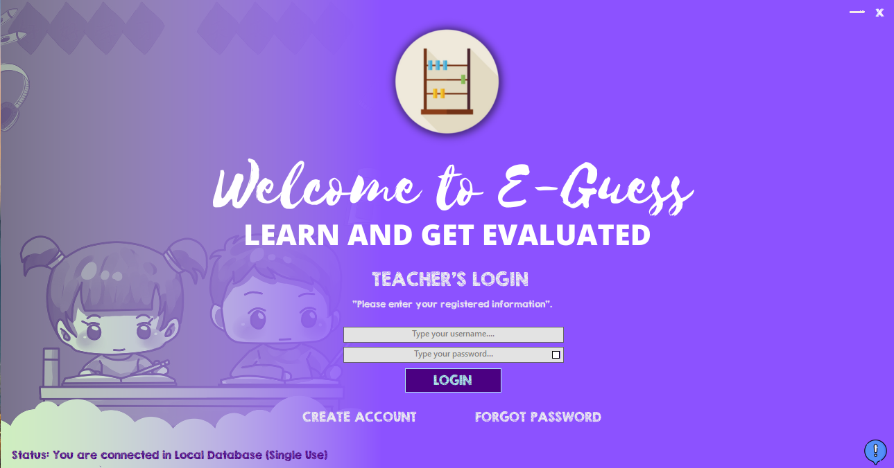
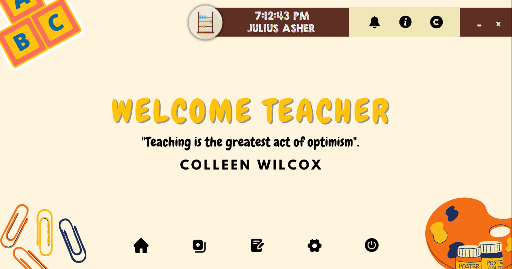
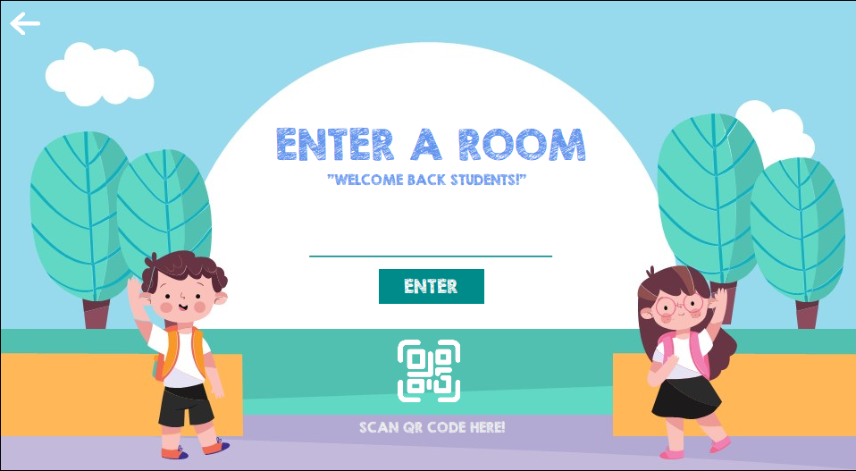

# E-Guess 8.5

E-Guess is a desktop application built with C# and Visual Studio that uses adaptive algorithms to assess and enhance children's strength and skills. Designed for learning and play, it adjusts difficulty in real time based on user performance.

## 🔧 Features
- Adaptive difficulty algorithm
- Kid-friendly UI
- Progress tracking
- Built with .NET and WinForms

## 📷 Screenshots

### Teacher's Login Interface

  ### Teacher's Homepage

  ### Student's Login

### Student's Game Room

## 🚀 How to Run
1. Open the solution file in Visual Studio
2. Build and run the project
3. Enjoy!

## 📦 Technologies
- C#
- .NET Framework
- Visual Studio

